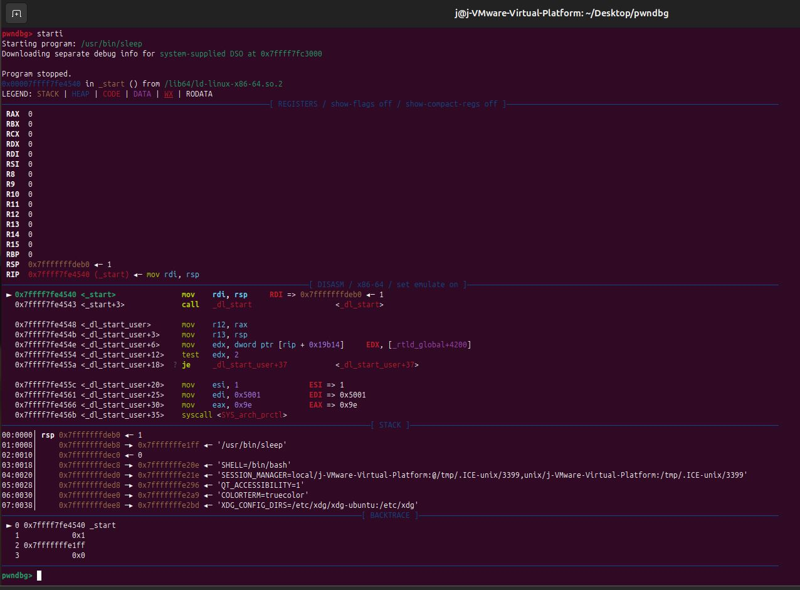
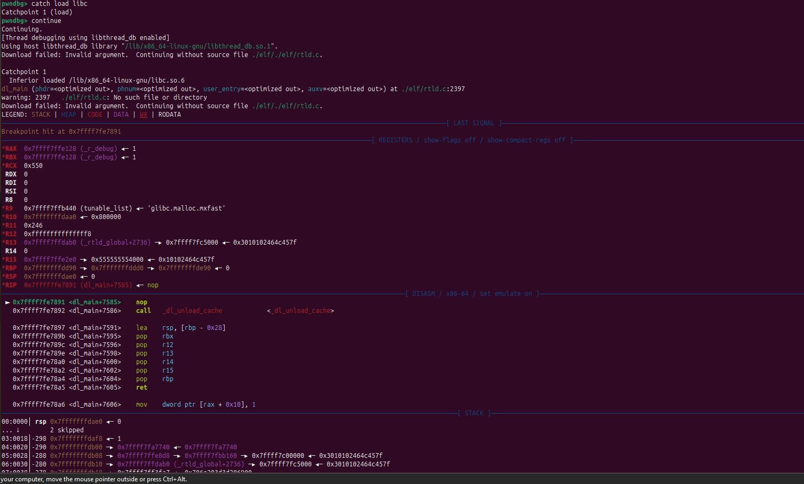
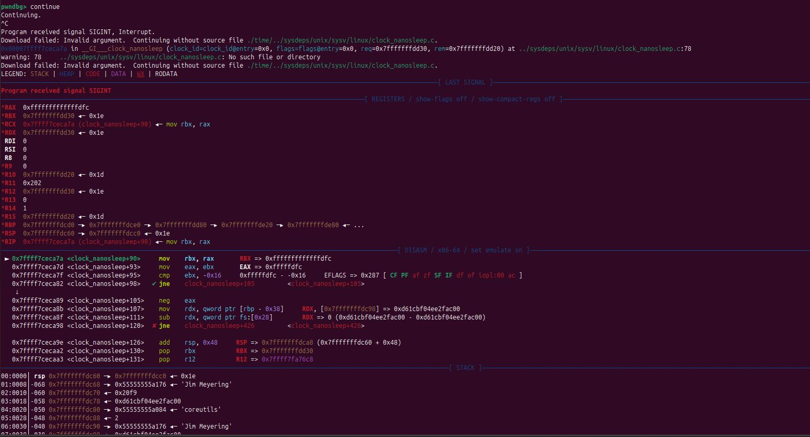
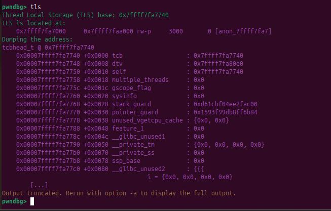
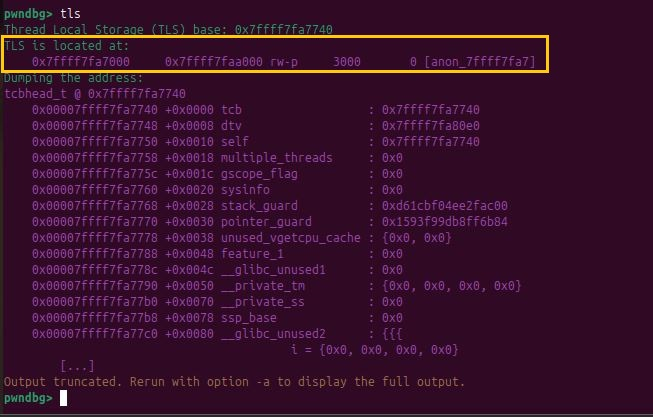
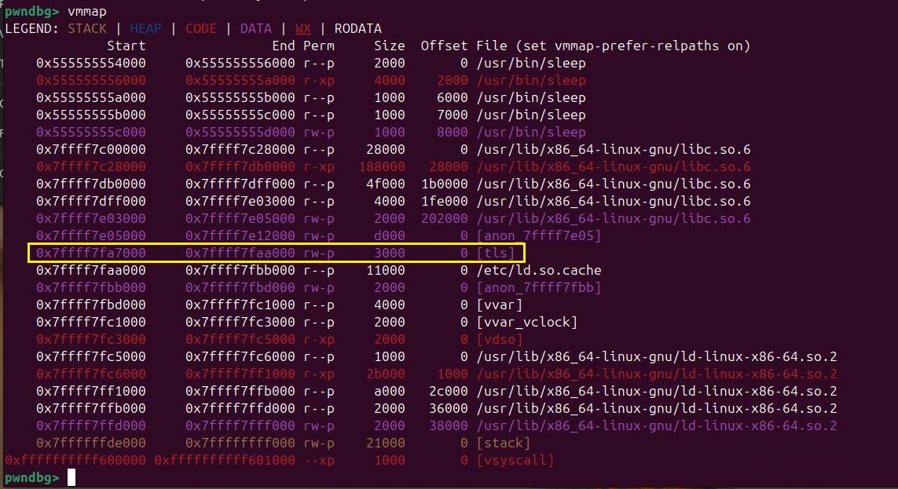

# Contribution #1: Label the TLS in vmmap

**Contribution Number:** 1

**Student:** Jonathan Morales

**Issue:** [https://github.com/pwndbg/pwndbg/issues/1570](https://github.com/pwndbg/pwndbg/issues/1570)

**Status:** Phase I

---

## Why This Issue

pwndbg is a plugin for GDB, a debugger that lets you pause and inspect a running program's memory. pwndbg extends GDB with commands such as `vmmap` and `tls` that present memory information in a readable, structured format, which is particularly useful during exploit development and reverse engineering.

When a program runs, the operating system divides its memory into regions. Some regions have meaningful labels, such as `[heap]` for dynamic memory allocation and `[stack]` for function-call data. Thread Local Storage (TLS) is another region where each thread stores private variables, such as the stack canary and thread pointer.

The `vmmap` command displays all memory regions. The TLS region appeared as `[anon_7ffff7fa7]` because the kernel reports it as an anonymous mapping with no name. pwndbg already resolves the TLS address through the `tls` command using the `fsbase` register on x86-64, but that address was never used to label the corresponding region in `vmmap` output. The change is limited to a small, well-defined part of the codebase and requires understanding of how pwndbg builds its memory map, how the `tls` command resolves addresses, and how the `Page` object controls which labels are displayed.

---

## Understanding the Issue

### Problem Description

The `tls` command resolves the Thread Local Storage base address using architecture-specific registers (`fsbase` on x86-64). The `vmmap` command is unaware of this and displays the same memory region with a generic anonymous label instead of `[tls]`.

### Expected Behavior

The TLS memory region should be labeled `[tls]` in `vmmap` output, consistent with how `[heap]` and `[stack]` are already annotated.

### Current Behavior

```
pwndbg> tls
Thread Local Storage (TLS) base: 0x7ffff7fa7740
TLS is located at:
    0x7ffff7fa7000     0x7ffff7faa000 rw-p     3000       0 [anon_7ffff7fa7]

pwndbg> vmmap
...
    0x7ffff7fa7000     0x7ffff7faa000 rw-p     3000       0 [anon_7ffff7fa7]
...
```

### Affected Components

- `pwndbg/commands/tls.py` - user-facing command that displays TLS information by calling `pwndbg.aglib.tls.find_address_with_register()`
- `pwndbg/aglib/vmmap.py` - fetches, caches, and returns memory map pages
- `pwndbg/lib/memory.py` - defines the `Page` object and its `objfile` field, which controls region labels

---

## Reproduction Process

### Environment Setup

Reproduced on Ubuntu 24.04 running inside a VMware virtual machine. pwndbg was cloned from the official repository and installed via `./setup.sh`. A missing C++ compiler caused the setup to fail initially; it was resolved by running `apt install -y g++ build-essential` before retrying.

### Approach

`/usr/bin/sleep` was chosen as the target binary because it remains running long enough to inspect its memory. Binaries without debug symbols cannot use `break main`, so `starti` was used instead to stop at the very first instruction. From there, execution needed to advance far enough for TLS to be fully initialized before `tls` and `vmmap` could be run. A catchpoint on libc load allowed controlled progression through the dynamic linker initialization. Once past that point, `continue` followed by `Ctrl+C` paused the process mid-execution while it was sleeping, at which point TLS was fully initialized and available for inspection.

### Steps to Reproduce

1. Launch GDB targeting `/usr/bin/sleep`:
   ```
   gdb /usr/bin/sleep
   ```

2. Stop at the very first instruction. TLS does not exist yet at this point because the dynamic linker has not run:
   ```
   starti 30
   ```

3. Set a catchpoint on libc load to pause execution once the dynamic linker has progressed far enough:
   ```
   catch load libc
   continue
   ```

4. Continue past the catchpoint. Once the process is sleeping, interrupt it with `Ctrl+C`. TLS is fully initialized at this point:
   ```
   continue
   ^C
   ```

5. Run `tls` to confirm the TLS base address is resolved:
   ```
   tls
   ```

6. Run `vmmap` and observe the same address range labeled as anonymous instead of `[tls]`:
   ```
   vmmap
   ```

### Reproduction Evidence

**Step 2 - Stopped at `_start` before TLS is initialized:**



**Step 3 - Caught libc loading via the dynamic linker:**



**Step 4 - Process interrupted inside `clock_nanosleep` while sleeping:**



**Steps 5 and 6 - `tls` resolves the base address, `vmmap` shows the same region as anonymous:**



**Findings:** The `tls` command correctly identifies `0x7ffff7fa7740` as the TLS base and internally calls `pwndbg.aglib.vmmap.find(tls_base)` to locate the containing page. That page label is never updated. The two commands resolve the same address independently with no shared labeling step between them.

---

## Solution Approach

### Analysis

The root cause is that `vmmap` builds its page list from `/proc/PID/maps`, which labels anonymous mappings generically. The `tls` command resolves the TLS address separately but does not write that information back into the memory map. The `Page` object has an `objfile` field that controls the label displayed in `vmmap` output. Setting that field to `[tls]` on the matching page is the correct approach.

### Approach

`find_address_with_register()` reads the `fsbase` register directly to get the TLS base address. This was chosen over `find_address_with_pthread_self()` because calling `pthread_self()` in the target process has side effects, as noted in the original issue thread. Register reads have no impact on the target process.

Once the address is resolved, `lookup_page()` finds the matching `Page` object in the memory map, and sets its `objfile` field to `[tls]`, using the same mechanism used to label `[heap]` and `[stack]`.

A separate helper function `_label_tls_region()` was created and called from both `get_memory_map()` and `_stop_cached_memory_map()` because `vmmap.py` has two code paths for fetching the memory map: the default path on Linux/GDB and the persistent cache path on macOS/LLDB. Both paths needed the same labeling logic.

### Implementation Plan

Using UMPIRE framework (adapted):

**Understand:** `vmmap` shows the TLS region as anonymous because it reads labels directly from the OS with no TLS awareness. The address is already resolvable through the existing `tls` command infrastructure using `fsbase`.

**Match:** The `Page` object's `objfile` field is used throughout the codebase to control region labels. The same mechanism already labels `[heap]` and `[stack]`.

**Plan:**
1. Add `import pwndbg.aglib.tls` to `pwndbg/aglib/vmmap.py`
2. Create a new helper function `_label_tls_region(memory_map)` that calls `find_address_with_register()`, finds the matching page via `lookup_page()`, and sets `page.objfile = "[tls]"` if valid
3. Call `_label_tls_region()` from both `_stop_cached_memory_map()` and `get_memory_map()` to cover both code paths
4. If TLS is not initialized or the address is 0, return cleanly without modifying anything

**Implement:** [Link to branch/commits as work progresses]

**Review:** Verify the change follows pwndbg contribution guidelines, does not break existing `vmmap` tests, and handles edge cases, including uninitialized TLS, remote targets, and non-x86 architectures.

**Evaluate:** Run `vmmap` after interrupting a live process and confirm the TLS region displays as `[tls]`.

### Result Evidence

**Before - TLS region labeled as anonymous:**


```
vmmap
```

**After - TLS region correctly labeled:**


```
vmmap
```

---

## Testing Strategy

### Unit Tests

- [ ] TLS region is labeled `[tls]` when the address is valid and resolved via register
- [ ] No label change occurs when TLS address cannot be resolved (returns 0 or None)
- [ ] Existing `[heap]` and `[stack]` labels are unaffected

### Integration Tests

- [ ] Full reproduction scenario: `starti` then `catch load libc` then `continue` then `Ctrl+C` then `vmmap` shows `[tls]`
- [ ] Behavior is correct when multiple threads are present

### Manual Testing

Reproduced the bug on Ubuntu 24.04 with `/usr/bin/sleep 30` as the target. After the process was fully initialized and then interrupted, `tls` resolved the address, and `vmmap` confirmed that the same region was labeled `[anon_...]`. After applying the change to `vmmap.py`, the same region correctly displayed as `[tls]`.

---

## Implementation Notes

### Week 1 Progress

Reproduced the issue on Ubuntu 24.04 inside a VMware virtual machine. Read through `tls.py`, `vmmap.py`, `memory.py`, and `dbg_mod/__init__.py` to understand how pages are fetched, cached, and labeled. Confirmed `Page.objfile` is mutable and that `lookup_page()` returns the actual object rather than a copy, making in-place modification safe. Set up required installing a missing C++ compiler before `./setup.sh` could complete.

### Code Changes

- **Files modified:** `pwndbg/aglib/vmmap.py`
- **Key commits:** [To be added]
- **Approach decisions:** Register-based TLS resolution via `find_address_with_register()` was chosen to avoid calling `pthread_self()` implicitly, which was flagged as a concern in the issue thread. A dedicated helper function `_label_tls_region()` was introduced rather than inlining the logic to avoid duplication across both memory map code paths.

---

## Pull Request

**PR Link:** [To be submitted]

**PR Description:** [To be drafted]

**Maintainer Feedback:** [Pending]

**Status:** In progress

---

## Learnings and Reflections

### Technical Skills Gained

Gained hands-on familiarity with how pwndbg builds and labels memory map pages, and how the `tls` command resolves addresses via architecture-specific registers. Deepened understanding of TLS initialization order relative to the dynamic linker and why TLS is unavailable at `_start`.

### Challenges Overcome

TLS is not available at `_start` because the dynamic linker has not run yet, so early breakpoints returned nothing from the `tls` command. The correct approach was to catch the libc load, continue past it, and then interrupt the process with `Ctrl+C` once it was fully running. Initial attempts using `break main` failed because the binary lacked debug symbols.

### What Would Be Done Differently Next Time

Reading the relevant source files before starting reproduction would clarify the direction of the fix earlier. Understanding `objfile` and how page labels work from the start would have significantly shortened the analysis phase.

---

## Resources Used

- [pwndbg issue #1570](https://github.com/pwndbg/pwndbg/issues/1570)
- [pwndbg source - aglib/vmmap.py](https://github.com/pwndbg/pwndbg/blob/dev/pwndbg/aglib/vmmap.py)
- [pwndbg source - commands/tls.py](https://github.com/pwndbg/pwndbg/blob/dev/pwndbg/commands/tls.py)
- [pwndbg source - aglib/tls.py](https://github.com/pwndbg/pwndbg/blob/dev/pwndbg/aglib/tls.py)
- [pwndbg official documentation](https://pwndbg.re)
